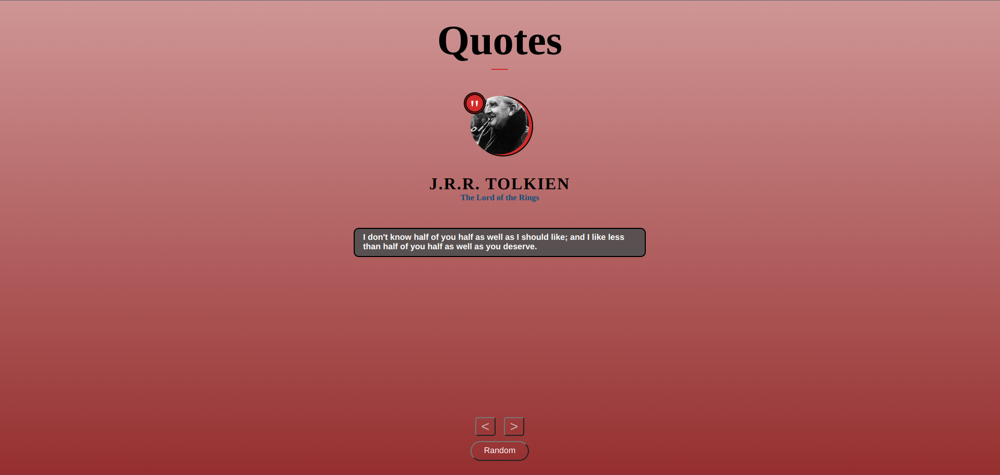

# QUOTES PROJECT

## FRONTEND PRACTICE PROJECT NO: 3

1. I used Javascript, Jquery, HTML, CSS to practice my skills.

2. When we click button or press from keyboard, the image and the information about the quote changes.

3. You can also click random button to get a random information and image.
